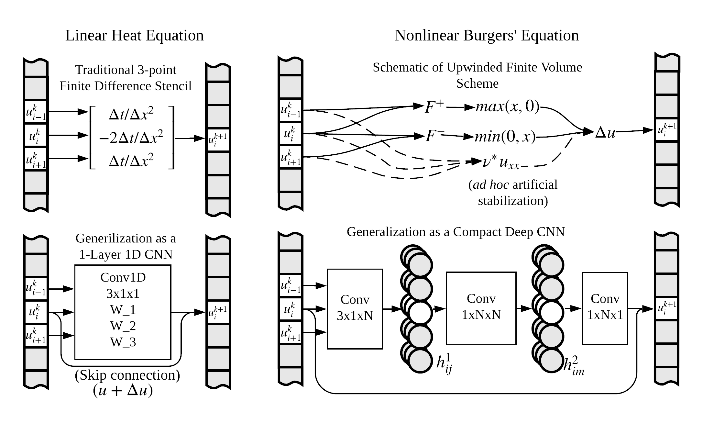

# Solving 1D PDEs with Neural Networks

Alejandro Francisco Queiruga  
Lawrence Berkeley National Lab, 2019

We can design neural networks that look like existing numerical models:

and there's opportunity to use them to learn complicated numerical schemes that are better than we can design by hand. However, I'm not sure what are the bounds on learning physically meaningful patterns, so I tested that out on the easiest problems I could find.

The initial work was submitted to a conference workshop with the title "Studying Shallow and Deep Convolutional Neural Networks as Learned Numerical Schemes on the 1D Heat Equation and Burgers' Equation". The paper source can be found under [paper/neurips_2019.tex](paper/neurips_2019.tex) or [the preprint on arxiv](https://arxiv.org/abs/1909.08142). The tag "submission2019" reflect the state of the repository for that submission; this code is still under active research.

## Methodology

We use analytical solutions to generate datasets for the following equations:

1. The Heat Equation: Linear Parabolic
1. The Poisson Equation: Linear Elliptic
1. The Wave Equation: Linear Hyperbolic
1. Burger's Equation: Nonlinear conservative with shocks
1. Korteweg–de Vries (KdV) equation: Nonlinear with solitons
1. The Euler-Bernouli Beam Equation: Linear, biharmonic

The code to make the datasets is [analytical_solutions.ipynb](analytical_solutions.ipynb), and the outputs are .npz files in [data/](data).
Most of the analytical solutions are taken in the `detest` testing framework should you wish to generate more data (or test a PDE solver.) 

## Hypothesis testing in progress:

1. The 3-parameter convolution layer will learn the expected weights
   with standard training techniques. **true**
1. Purely advsererial training will work but slowly: **negative result**
1. Adding adverserial training will improve stability **invalidated by
   2**
1. Need 2 history snapshots for the wave equation *todo*
1. Parameter-bottleneck autoencoder will not generalize to multiple
   trajectories *todo*
1. The CFL condition dictates connectivity and stability of the
   networks; need a U-net or a fully connected model for the heat
   equation and poisson equation. *todo*
   

